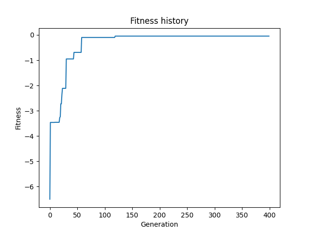

# Genetic Algorithm Framework
## Description
This project presents a versatile Python-based genetic algorithm framework designed for tackling a broad spectrum of optimization challenges. By incorporating a variety of genetic operators such as selection, crossover, mutation, and fitness evaluation, the framework boasts high flexibility and adaptability. It is especially suited for complex optimization tasks ranging from classical mathematical problems to real-world application scenarios like scheduling, machine learning model optimization, and more.

## Features
- Modular Design: Tailor genetic operators including crossover (e.g., Arithmetic, SinglePoint), mutation (e.g., UniformMutation), and selection methods (e.g., Roulette, Tournament, and Random Selection) to fit the specific needs of various optimization problems.
- Diverse Problem Solving: Demonstrates its utility with included examples like the Ackley Problem and Max Zero Problem, while being easily extendable to more complex scenarios such as route planning (TSP), portfolio optimization, and neural network weight optimization.
- Visualization Enhancements: Leverages Matplotlib for in-depth visualization of the algorithm's evolutionary process, offering insights into the optimization landscape and genetic diversity over generations.
- Extensibility & Customizability: Designed for users to define custom problems, mutations, crossovers, selection operators, and fitness functions by extending intuitive base classes, facilitating the exploration of novel genetic algorithm variants.
- Real-World Applications: Guides on applying the framework to real-world problems, including but not limited to, optimizing machine learning models, resource allocation, and game strategy development.

## Example of Usage

This section provides a detailed example of how to use the Genetic Algorithm Framework to solve an optimization problem, specifically demonstrating the maximization of Ackley's function. By following this guide, you can quickly set up and run the framework to see how the genetic algorithm evolves to find a solution over generations.

### Maximizing Ackley's Function
Ackley's function is a well-known complex mathematical function used for testing optimization algorithms. In this example, we use the genetic algorithm framework to find the maximum value of Ackley's function.


1. Starting the Algorithm: To begin, you can use the following command to start the genetic algorithm process. This command executes the __main__.py file in the genetic algorithm framework package, which is set up to tackle Ackley's problem:

```bash 
python -m genetic 
```

This command initializes the genetic algorithm with default parameters and targets the maximization of Ackley's function.

2. Understanding the Process: The __main__.py file contains code that defines Ackley's problem, sets up the genetic algorithm with appropriate parameters (e.g., population size, mutation rate, crossover rate), and runs the algorithm. The process involves evaluating individuals in the population against the Ackley function, selecting the best performers, applying genetic operators, and generating new populations over several generations.

3. Observing the Evolution: As the genetic algorithm runs, it prints the best fitness value found in each generation to the console, allowing you to observe the algorithm's progress in real-time. The goal is to see improvement in the fitness values as the algorithm evolves.

4. Graphical Representation: Upon completion, the framework generates a graph using Matplotlib that visualizes the algorithm's performance over generations. This graph shows how the best fitness value in the population improves over time, providing a clear visual representation of the algorithm's optimization process.



<p align="center">
  
</p>

5. Interpreting the Results: The final output includes the best solution found for maximizing Ackley's function along with its fitness value. By analyzing the generated graph and the output data, you can assess the effectiveness of the genetic algorithm in solving the optimization problem.

By following these steps, you can utilize the genetic algorithm framework to experiment with and solve complex optimization problems, gaining insights into the power and versatility of genetic algorithms.

## Requirements
- Python 3.x
- Pandas
- NumPy
- Matplotlib

## Installation
Clone this repository to your local machine:

```bash 
git clone https://github.com/vitorodesouza/GeneticAlgorithm
```

Navigate to the cloned directory and install the required packages:

```bash 
cd GeneticAlgorithm
pip install -r requirements.txt 
```

Feel free to test different optimization challenges, experiment with various genetic operators, and fine-tune the algorithm parameters according to your needs.

## Advanced Usage and Customization
- Defining Custom Problems: Learn how to frame your optimization problem within the framework for efficient solving.
- Operator Customization: Detailed guidance on creating bespoke genetic operators to navigate unique problem landscapes.
- Parameter Tuning: Tips on optimizing algorithm parameters for enhanced performance and solution quality.

## Contributing
Contributions to the project are welcome! Here's how you can contribute:

- Bug Reports: Open an issue if you find a bug.
- Feature Requests: Have an idea to improve the framework? Share it by opening an issue.
- Pull Requests: Submit pull requests with bug fixes or new features. Please ensure your code adheres to the project's coding standards.

## License
MIT License

